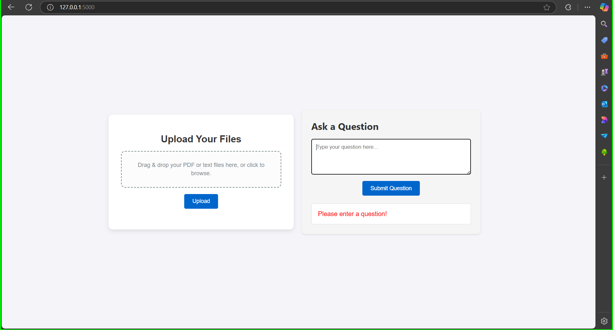

# 🚀 Document-Based RAG (Retrieval-Augmented Generation) Application

An intelligent document querying app that uses state-of-the-art retrieval and generation techniques to extract meaningful insights from uploaded files. Simplify document analysis with powerful embeddings and OpenAI's GPT model.

### 📖 About

This application combines the best of retrieval-based NLP and generative AI to create a seamless Q&A experience for document analysis. Simply upload a PDF or text file, and let the app:

Retrieve relevant content from the document using embeddings.
Generate contextual answers with OpenAI’s GPT.
Say goodbye to manually searching through lengthy documents!

### ✨ Features

🗂 Upload Documents: Supports PDF and TXT files.

🔍 Context-Aware Retrieval: Extracts the most relevant sections of the document using embeddings.

💡 Generative AI Responses: Leverages OpenAI GPT for human-like, intelligent answers.

🌐 Interactive UI: Simple user interface for query submission.

🔄 Chunk-Based Encoding: Splits documents into meaningful sections for better context understanding.

🔒 Secure and Local: Files are stored and processed securely on your machine.

### 📚 Technologies Used

### Backend:

Flask
Sentence-Transformers (all-MiniLM-L6-v2) for embedding
PyPDF2 for PDF parsing
OpenAI GPT-3.5/4 API

### Frontend:

HTML/CSS for the UI

### Environment:

How to create Environment

pip install virtualenv

python -m venv your_env_name
Python 
dotenv for managing environment variables

### 🛠️ Setup and Installation

1. Clone the repository:

git clone https://github.com/vinitpol/RAG-Retrieval-Augmented-Generation-Application.git

2. Create and activate a virtual environment:

python -m venv env
source env/bin/activate   # For Linux/Mac
env\Scripts\activate      # For Windows

3. Install dependencies:

pip install -r requirements.txt

4. Add your OpenAI API Key:

->Create a .env file in the project root

OPENAI_API_KEY=your_openai_api_key

5. Run the app:

python app.py

6. Open in your browser:

http://127.0.0.1:5000

### 🌟 How It Works

1. Upload Document: Drop a PDF or TXT file.

2. Query: Type your question in natural language.

3. Retrieve: The app uses embeddings to locate the most relevant text chunk.

4. Generate: OpenAI GPT generates a detailed, context-aware answer.

### 📂 Project Structure

'''
├── app.py              # Flask app logic
├── templates/          # HTML templates
├── uploads/            # Directory for uploaded documents
├── requirements.txt    # Python dependencies
├── .env                # Environment variables (add your OpenAI key here)
└── README.md           # Project README
'''

### 🎨 Screenshots

#### 🖥️ Home Page & 💬 Query Page

### Error Handed

If user Not Enter any Query then Will be displayed Above Error 

### 🧠 Future Enhancements

🌍 Multi-language support for queries and documents.

📊 Add visual insights and summarization features.

📦 Dockerize the application for seamless deployment.

⚡️ Extend support for more file types (Word, Excel).

### 🤝 Contributing

Contributions are welcome! Follow these steps:

Fork the repo.

Create a new branch: git checkout -b feature-name.

Commit changes: git commit -m 'Add feature-name'.

Push to your branch: git push origin feature-name.

Submit a pull request.

### 📬 Contact

Author: Vinit Pol

Email: vinitpol2000@gmail.com

GitHub: vinitpol45
